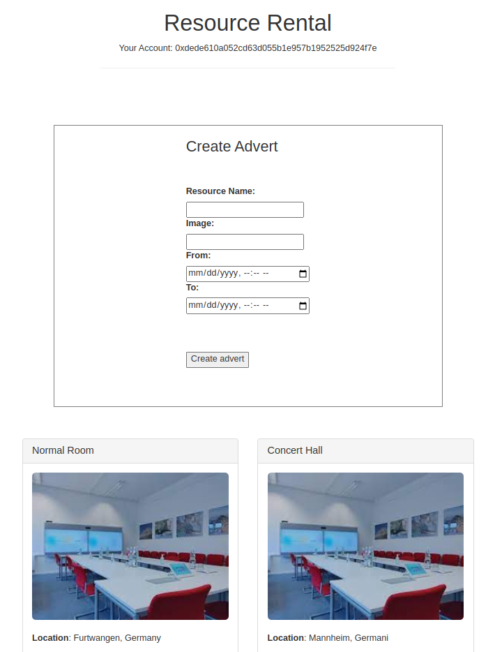

# DappResourceRental

Decentralized Application for resource rental 

Steps to run the project:

Install Truffle globally

`npm install -g truffle`

run the migrations:

`truffle migrate --reset`

Install the dependencies

`yarn install`

Start application 

`yarn dev`

Demo:

